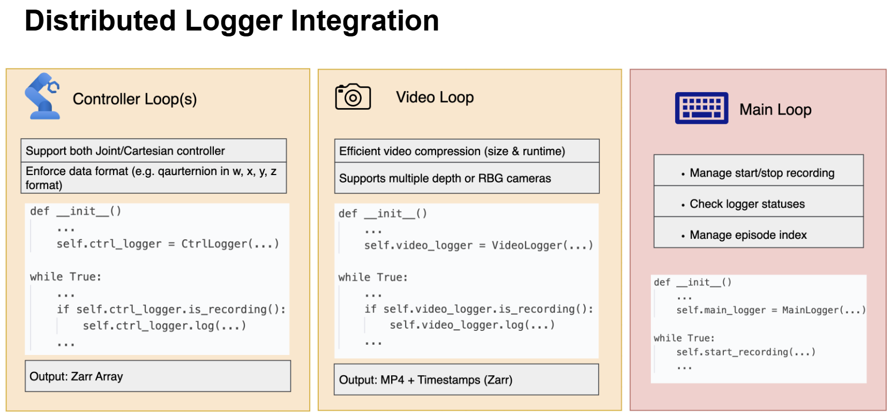

# RoboLogger Examples

Examples showing how to integrate RoboLogger into a robot system.

---

## Quick Start

### Step 1: Start Control Loops

Open 3+ terminals and start the control loops. Choose the robot control example that matches your setup:

```bash
# Terminal 1: Camera loop
python examples/camera_loop.py

# Terminal 2: Robot control (choose mode via --mode flag)
python examples/robot_control_loop.py --mode joint      # Joint control (should also log FK-inferred EEF pose for rich information)
python examples/robot_control_loop.py --mode cartesian  # Cartesian/EEF control (should also log joint pos if available for rich information)

# Terminal 3: Gripper control
python examples/gripper_control_loop.py
```

### Step 2: Start Main Process

```bash
# Terminal 4: Main coordinator
python examples/main_process.py
```

### Step 3: Control Recording

Use keyboard commands in the main process terminal:

| Key | Action |
|-----|--------|
| `s` | Start recording episode |
| `e` | End recording episode |
| `d` | Delete last COMPLETED episode |
| `y` | Mark last episode as successful |
| `n` | Mark last episode as failed |
| `q` | Quit and shutdown |

---

## Architecture Overview

RoboLogger uses a distributed design where control loops run independently and the main process coordinates recording:



```
Main Process (coordinator; main entry point)
    |
    ├─── Camera Loop        (e.g. 30 Hz)
    ├─── Robot Loop         (e.g. 125 Hz)
    └─── Gripper Loop       (e.g. 30 Hz)
```

### Key Principles

- Control loops run continuously at their own frequencies
- Main process manages recording statuses internally
- Data is only logged when recording is active
- All timestamps use `time.monotonic()` for consistency
- **State** = actual measured values
- **Target** = commanded values

---

## Example Files Reference

| File | Logger Type | Data Logged |
|------|-------------|-------------|
| `main_process.py` | MainLogger | Episode metadata (project, task, run, morphology, is_successful) |
| `camera_loop.py` | VideoLogger | Video streams (.mp4) with timestamps* |
| `robot_control_loop.py --mode cartesian` | RobotCtrlLogger | EEF pose only (state + target) **NOTE: Should also log joint pos if it can be inferred** |
| `robot_control_loop.py --mode joint` | RobotCtrlLogger | (Inferred) EEF pose + joint positions (state + target) |
| `gripper_control_loop.py` | RobotCtrlLogger | Joint positions (state + target) |

*Number of cameras and streams depends on configuration

### Example Output Structure (when running robot_control_loop.py --mode joint)

```
data/demo_project/demo_task/run_001/episode_000000/
├── metadata.zarr/
│   └── .zattrs                      # project_name, task_name, run_name, morphology, is_successful
├── right_wrist_camera_0.zarr/
│   ├── main.mp4
│   ├── ultrawide.mp4
│   ├── depth.mp4
│   ├── main_timestamps/
│   ├── ultrawide_timestamps/
│   └── depth_timestamps/
├── right_arm.zarr/
│   ├── state_pos_xyz/
│   ├── state_quat_wxyz/
│   ├── state_joint_pos/
│   ├── state_timestamps/
│   ├── target_pos_xyz/      # (if target_type=="eef_pose"; won't show up when running joint mode in the provided example)
│   ├── target_quat_wxyz/    # (if target_type=="eef_pose"; won't show up when running joint mode in the provided example)
│   ├── target_joint_pos/    # (if target_type=="joint_pos")
│   └── target_timestamps/
└── right_end_effector.zarr/
    ├── state_joint_pos/
    ├── target_joint_pos/
    ├── state_timestamps/
    └── target_timestamps/
```

---

## RobotCtrlLogger Configuration

The unified `RobotCtrlLogger` supports flexible control configurations for arms and grippers.

### Configuration Parameters

| Parameter | Type | Description |
|-----------|------|-------------|
| `log_eef_pose` | bool | Log end-effector pose (position + quaternion) |
| `log_joint_pos` | bool | Log joint positions |
| `target_type` | str | Control mode: `"eef_pose"` or `"joint_pos"` |
| `joint_units` | str | Joint units: `"radians"`, `"meters"`, or `None`. **NOTE:** Use `"meters"` for grippers, `"radians"` for joint-controlled robot arms, and `None` only for EEF-controlled arms whose joint positions cannot be inferred. **As a general rule of thumb, if both joint positions and EEF pose can be inferred, always log both for maximum information richness.** |

### Use Case 1: EEF-Controlled Arm with Joint Encoders

```python
RobotCtrlLogger(
    name="right_arm",
    attr={"num_joints": 7},
    log_eef_pose=True,
    log_joint_pos=True,   # Log observed joint positions
    target_type="eef_pose",
    joint_units="radians"
)
```

**Logged data:** All EEF pose fields + `state_joint_pos` (no `target_joint_pos` since control is EEF-based)

### Use Case 2: Joint-Controlled Arm with Inferred EEF Pose

```python
RobotCtrlLogger(
    name="left_arm",
    attr={"num_joints": 7},
    log_eef_pose=True,          # Computed via forward kinematics
    log_joint_pos=True,
    target_type="joint_pos",
    joint_units="radians"
)
```

**Logged data:** All EEF pose fields + `state_joint_pos`, `target_joint_pos`

**Why this is recommended:** Captures complete state information for replay and analysis.

### Use Case 3: Joint-Controlled Gripper

```python
RobotCtrlLogger(
    name="right_end_effector",
    attr={"num_joints": 1},
    log_eef_pose=False,
    log_joint_pos=True,
    target_type="joint_pos",
    joint_units="meters"
)
```

**Logged data:** `state_joint_pos`, `target_joint_pos`

### Use Case 4: EEF-Controlled Arm Without Joint Position Feedback

```python
RobotCtrlLogger(
    name="right_arm",
    log_eef_pose=True,
    log_joint_pos=False,
    target_type="eef_pose",
    joint_units=None
)
```

**⚠️ NOT RECOMMENDED if joint positions can be inferred.** Always log joint positions when available for richer information.

**Logged data:** `state_pos_xyz`, `state_quat_wxyz`, `target_pos_xyz`, `target_quat_wxyz`

---

## Adapting to Your Robot System

### 1. Replace Simulated Data with Robot API Calls

The example files use simulated data. Replace these sections with your robot's API:

#### Camera Loop ([camera_loop.py:70-81](camera_loop.py))
```python
image = camera.capture()  # Replace simulated rainbow frames
```

#### Robot Control Loop - Cartesian Mode ([robot_control_loop.py:79-82](robot_control_loop.py))
```python
state_pos_xyz, state_quat_wxyz = robot.get_eef_pose()
```

#### Robot Control Loop - Joint Mode ([robot_control_loop.py:158-164](robot_control_loop.py))
```python
state_joint_pos = robot.get_joint_pos()
state_pos_xyz, state_quat_wxyz = robot.forward_kinematics(state_joint_pos)
```

#### Gripper Control Loop ([gripper_control_loop.py:48-52](gripper_control_loop.py))
```python
state_joint_pos = gripper.get_width()
```

### 2. Configure Communication Endpoints

Ensure endpoints in `main_process.py` match the control loop endpoints.

**Default configuration used in examples:**
- Camera loop: `tcp://localhost:55555`
- Robot loop: `tcp://localhost:55556`
- Gripper loop: `tcp://localhost:55557`

### 3. Use Valid Logger Names

Logger names must match enums defined in [robologger/utils/classes.py](../robologger/utils/classes.py):

**Camera names:**
- Pattern: `{position}_{mount}_{index}`
- Examples: `right_wrist_camera_0`, `head_camera_0`, `left_wrist_camera_1`
- Must be continuous and zero-indexed

**Robot component names:**
- Arms: `right_arm`, `left_arm`
- End effectors: `right_end_effector`, `left_end_effector`

### 4. Configure Success Labeling

Set `success_config` in `MainLogger` to control how episodes are labeled:

| Config | Behavior |
|--------|----------|
| `"none"` | No success field (field not included in metadata) |
| `"input_true"` | Prompt user with `[Y/n]` (defaults to successful) |
| `"input_false"` | Prompt user with `[y/N]` (defaults to failed) |
| `"hardcode_true"` | Always mark successful (no prompt) |
| `"hardcode_false"` | Always mark failed (no prompt) |
